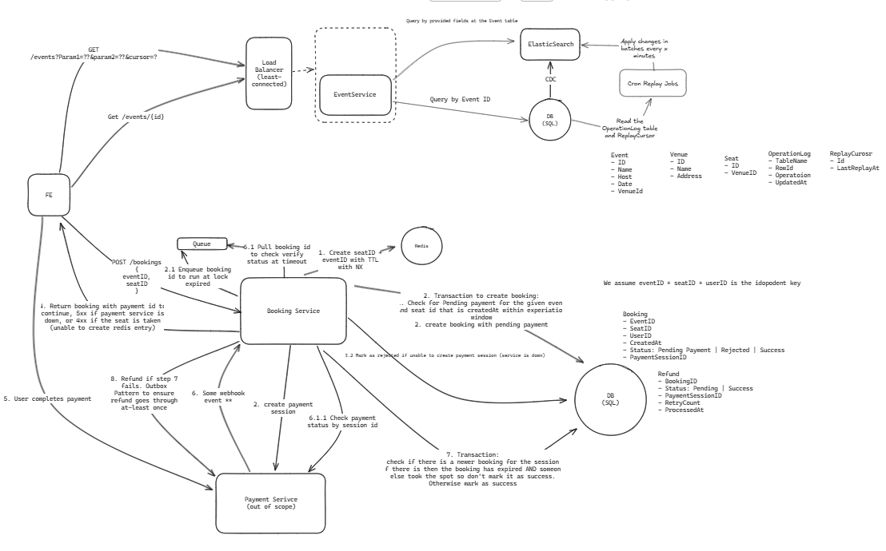

# Ticket Booking System

A distributed ticket booking system built to handle concurrent seat reservations reliably — preventing double-booking while remaining correct under payment failures and service outages.

This is a portfolio project. The goal was to design the system first (data model, state machine, failure modes), then hand the design off to an AI agent to implement, and evaluate both the design quality and the agent's ability to execute it faithfully.

## What This Demonstrates

| Concern | Pattern Used |
|---|---|
| Concurrent seat reservation | Redis distributed lock (`SET NX`) |
| Duplicate booking requests | Idempotency key on `(eventID, seatID, userID)` |
| Duplicate payment webhooks | First-write-wins on `paymentSessionID` |
| Refunds under payment outage | Transactional outbox with at-least-once delivery |
| Payment reconciliation | Webhook + BullMQ delayed job fallback |
| Derived state | `rejected` status computed at read time, never stored |

## System Design

This is the initial design diagram created before implementation — the starting point handed to the agent.



### Booking Flow

1. API acquires a Redis lock (`lock:{eventID}:{seatID}`, 32-minute TTL) — returns `409` if already held
2. Booking is written with status `pending`; a BullMQ job is scheduled for minute 30
3. Payment session is created; `paymentSessionID` is stored on the booking
4. User completes payment on the frontend
5. Payment service fires a webhook; booking service confirms the seat atomically
6. BullMQ job at minute 30 acts as fallback if webhook was never received

### State Machine

```
pending ──► success   (payment confirmed, seat won the conflict check)
pending ──► rejected  (derived: createdAt + 30min < now AND still pending)
```

`rejected` is never written to the database. It is computed at read time from `createdAt`. This avoids a whole class of race conditions around state transitions.

### Seat Confirmation Transaction (step 5/6)

When marking a booking as success, atomically:
1. Check if a newer booking exists for the same `eventID + seatID` (lock may have expired and re-acquired)
2. If conflict: do **not** mark success — write a refund request to the `outbox` table instead
3. Otherwise: mark `success`

Steps 2 and 3 happen in a single transaction so no refund can be lost even if the process crashes mid-flight.

### Outbox Pattern

Refund requests are written to an `outbox` table in the **same transaction** as step 5/6. A background worker polls the outbox and delivers to the payment service with retries. The payment service's refund handler is idempotent on `paymentSessionID`, so retries are safe.

## Architecture

| Service | Technology | Role |
|---|---|---|
| API | Node.js + Express (TypeScript) | Booking creation, webhook handling |
| Database | PostgreSQL 16 | Bookings, outbox, events, seats |
| Cache / Locks | Redis 7 | Distributed seat locks via `SET NX` |
| Job Queue | BullMQ | Delayed payment check at minute 30 |
| Payment | Mock HTTP service (TypeScript) | Session creation, refunds, webhook callbacks |
| Workers | Node.js (TypeScript) | Outbox processor, BullMQ job runner |

## Data Model

```
Event       { id, name, host, date, venueID }
Venue       { id, name, address }
Seat        { id, venueID, label }
Booking     { id, eventID, seatID, userID, createdAt, status, paymentSessionID }
              status ∈ { 'pending', 'success' }  — 'rejected' is derived, never stored
              unique on (event_id, seat_id, user_id)
Outbox      { id, type, payload, createdAt, processedAt }
              type = 'refund', processedAt NULL = unprocessed
```

## Running the App

```bash
docker compose up --build
```

- API: `http://localhost:3000`
- Mock payment service: `http://localhost:4000`

## API Reference

| Method | Endpoint | Description |
|---|---|---|
| `GET` | `/events` | Paginated event listing (`cursor`, `limit`, `date`, `host`) |
| `GET` | `/events/:id` | Event detail with seat availability |
| `POST` | `/bookings` | Create booking — body: `{ eventID, seatID }`, header: `x-user-id` |
| `POST` | `/webhooks/payment` | Payment completion callback — body: `{ paymentSessionID, status }` |
| `GET` | `/health` | Health check |

### Create Booking

```bash
curl -X POST http://localhost:3000/bookings \
  -H "Content-Type: application/json" \
  -H "x-user-id: <uuid>" \
  -d '{"eventID": "<uuid>", "seatID": "<uuid>"}'
```

Response:
```json
{ "bookingID": "...", "status": "pending", "checkoutURL": "http://localhost:4000/checkout/..." }
```

Errors:
- `409` — seat already locked (another booking in progress)
- `503` — payment service unavailable

## Unit Tests

33 Jest tests covering the core service layer (ts-jest).

```bash
npm test
```

| Suite | What's Tested |
|---|---|
| `lockService` | Acquire, release, check — Redis mock |
| `paymentClient` | Session creation, refund, 503 handling |
| `bookingService` | `deriveStatus`, idempotent webhook, atomic confirmation, outbox refund path |

## Concurrency Integration Tests

An end-to-end integration test suite that verifies correctness invariants under concurrent load and injected failures. These are correctness tests, not performance benchmarks.

```bash
# Start app + run integration tests in one command
docker compose --profile integration-test up --build

# App already running — run tests once
docker compose --profile integration-test run --rm integration-test

# Run directly against a locally running app
npm run integration-test
```

The integration-test container exits `0` (all pass) or `1` (any failure).

### Scenarios

| Scenario | Description | Assertion |
|---|---|---|
| **Baseline** | 50 users book 50 different seats concurrently | All 50 return 201, no double bookings |
| **Seat Contention** | 30 users race for 1 seat | Exactly 1 wins (201), 29 get 409 |
| **Payment Failure** | Wave 1 succeeds; fault `down`; wave 2 fires | Wave 2 all get 503; wave 1 confirmed |
| **Webhook Idempotency** | Webhook fires + 2 manual duplicates sent | Duplicates return 200; exactly 1 success row |
| **Fault Mix** | 5 users × 3 seats, payment `slow` | 3 winners, refunds in outbox, all processed |

### Correctness Invariants

- No seat has more than one `success` booking
- `rejected` is never written to the database
- All pending non-expired bookings have a corresponding Redis lock
- All displaced bookings have an outbox refund entry
- All outbox entries are eventually processed

### Fault Injection Modes

The mock payment service exposes fault injection endpoints used by the test runner:

| Endpoint | Effect |
|---|---|
| `POST /test/fault/down` | All payment endpoints return 503 |
| `POST /test/fault/slow` | All payment endpoints add 2–5s random delay |
| `POST /test/fault/reset` | Restore normal operation |
| `GET /test/fault/status` | Query current fault mode |

## Environment Variables

| Variable | Default | Description |
|---|---|---|
| `DATABASE_URL` | `postgres://...@localhost:5432/ticketbooking` | PostgreSQL connection string |
| `REDIS_URL` | `redis://localhost:6379` | Redis connection string |
| `PAYMENT_SERVICE_URL` | `http://localhost:4000` | Payment service base URL |
| `BOOKING_WINDOW_MINUTES` | `30` | Minutes until a pending booking expires |
| `LOCK_TTL_SECONDS` | `1920` | Redis lock TTL (32 min = 30 min window + 2 min buffer) |
| `PORT` | `3000` | API server port |

> The integration-test container sets `BOOKING_WINDOW_MINUTES=2` so expiry scenarios don't need to wait 30 minutes.
